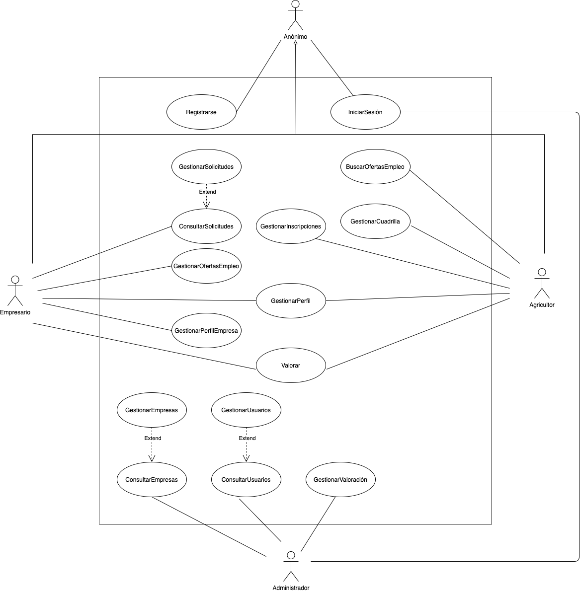

__Proyecto 3 - Puesta en contacto de empresarios con agricultores__

---

[Volver al índice](../../README.md)

---

# Práctica 2 - Especificación de requisitos

Ampliación de la memoria con la recopilación de requisitos.

* [Captura de requisitos](01-init.md)
* Definición de requisitos:
  * [Requisitos funcionales](02-requirement-f.md)
  * [Requisitos no funcionales](02-requirement-nf.md)
* [Validación de requisitos](03-validation.md)
* [Glosario de términos](04-glossary.md)

Por otro lado se ha realizado el análisis funcional, describiendo cada caso de uso con su correspondiente diagrama de actividad.

El sistema puede definirse como se muestra:

Que concretamente detallamos más en los siguientes archivos:

* [CU-1 Registro de empresarios](usecase/CU-registro.docx)
* [CU-2 Registro de agricultores](usecase/CU-registro.docx)
* [CU-3 Inicio de sesión](usecase/CU-iniciar_sesion.docx)
* [CU-4 Consultar usuarios](usecase/ConsultarUsuario.pdf)
* [CU-5 Consultar empresas](usecase/ConsultarEmpresa.pdf)
* [CU-6 Gestionar usuario](usecase/GestionarUsuario.pdf)
* [CU-7 Gestionar empresas](usecase/CU-GestionarEmpresas.docx)
* [CU-8 Consultar solicitudes](usecase/CU-ConsultarSolicitudes.docx)
* [CU-9 Gestionar solicitud](usecase/CU-GestionarSolicitud.docx)
* [CU-10 Consultar valoraciones](usecase/CU-ConsultarValoracion.docx)
* [CU-11 Gestionar valoración](usecase/CU-GestionarValoracion.docx)
* [CU-12 Buscar oferta de empleo](usecase/CU-BuscarOfertasEmpleo.docx)
* [CU-13 Valorar (empresarios y agricultores)](usecase/CU-Valorar.docx)
* [CU-14 Gestionar oferta de empleo](usecase/CU-GestionarOfertasEmpleo.docx)
* [CU-15 Gestionar inscripciones](usecase/CasoUsoGestionarInscripciones.docx)
* [CU-16 Gestionar cuadrillas](usecase/CasoUsoGestionarCuadrillas.docx)
* [CU-17 Gestionar perfil de empresa](usecase/CasoUsoGestionarPerfilEmpresa.docx)

Acompañados de sus diagramas de actividad:

* [Registro de empresarios](activity/iniciar_sesion.mdzip)
* [Registro de agricultores](activity/)
* [Inicio de sesión](activity/)
* [Consultar usuarios](activity/)
* [Consultar empresas](activity/)
* [Gestionar usuario](activity/)
* [Gestionar empresas](activity/)
* [Consultar solicitudes](activity/)
* [Gestionar solicitud](activity/)
* [Consultar valoraciones](activity/)
* [Gestionar valoración](activity/)
* [Buscar oferta de empleo](activity/)
* [Valorar (empresarios y agricultores)](activity/)
* [Gestionar oferta de empleo](activity/)
* [Gestionar inscripciones](activity/)
* [Gestionar cuadrillas](activity/)
* [Gestionar perfil de empresa](activity/)
